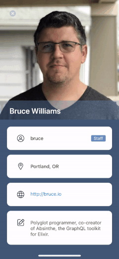

# GitHubApp


This is an app using GitHub API to show the info of the users those have registered at GitHub


## Requirements

- [x] iOS 12.0+
- [x] Xcode 11.4+


## Third Party (with Cocoapod)
- [Alamofire](https://github.com/Alamofire/Alamofire)
- [SDWebImage](https://github.com/SDWebImage/SDWebImage)


## Architecture

Using MVVM pattern with KVO binding view models


```bash
GitHubApp/
├── Network/
│   ├── Router/
│   └── Manager/
│
├── Model/
│
├── View/
│
├── ViewController/
│   ├── MainViewController/
│   └── DetailViewController/
│
├── ViewModel/
│
├── Extension/
│
└── Support/
```


### ViewOutlet

Different from others, I make an object call 'view outlet' to separate the IBOutlet from view controllers,  
like this:


#### MainViewOutlet

Declaire it in another file as an object,
```swift
class MainViewOutlet: NSObject {

    @IBOutlet weak var tableView: UITableView! {
        didSet {
            setupTableView()
        }
    }
}
```

#### MainViewController

then bind it in view controller

```swift
class MainViewController: BaseViewController {

    @IBOutlet weak var viewOutlet: MainViewOutlet!
    
    // Some other override functions
}

extension MainViewController {
	func SetupChangeListener() {
		// go through

		self.viewOutlet.tableView.reloadData()
		.
		.
		.
	}

}

```

### View Binding

#### KVO

Detecting the enum value which represent the API request status. Only if the status change will update those views.  
It will be like this, declaire it as a dynamic variable in view model,

```swift
@objc dynamic var apiAllUserStatus: APIStatus = .none
```

and observer it in view controller

```swift
viewModel.addChangeListener(\.apiAllUserStatus) { _ in
	// Implement the UI update
}
```

## Bonus

### Pagination

Enable to fetch new data batch by batch.  
Append new data when scrolling to the bottom of the table view.


### User Detail
Complete the user detail page.   
By the way, I has made a tiny little trick for the avatar view, I let the avatar view stick on the top and able to stretch with bounce!



## More

To learn more about the project, feel free to download or clone my repo!

